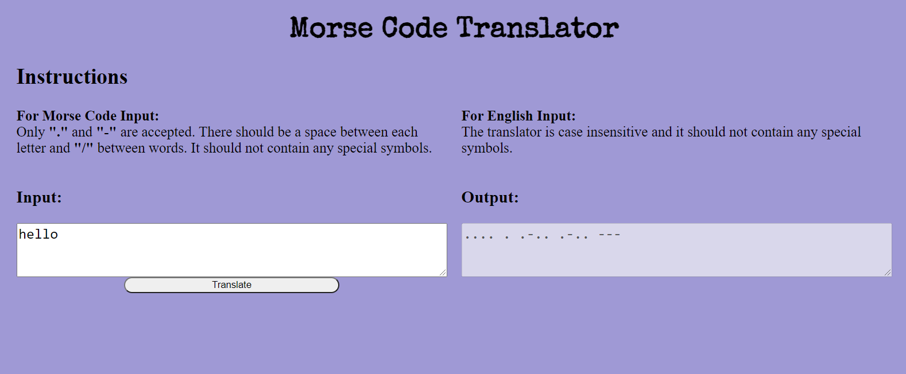

# Morse Code Translator
A morse code translator that can translate English words and sentences to Morse Code and Morse Code to English.

## General Info
This was created to practice Test Driven Developement and using Unit Testing with jest in Javascript.

The user is able to enter either English or Morse code words and senetences and the program translate it to the other. It is not able to handle an input that is a mix of English and morse Code.

### Tech Stack
- Javascript ES6
- HTML5
- CSS3/SASS
- jest

### Roadmap / Todo
- Add more test for translating numbers and special characters
- Add handling for special characters
